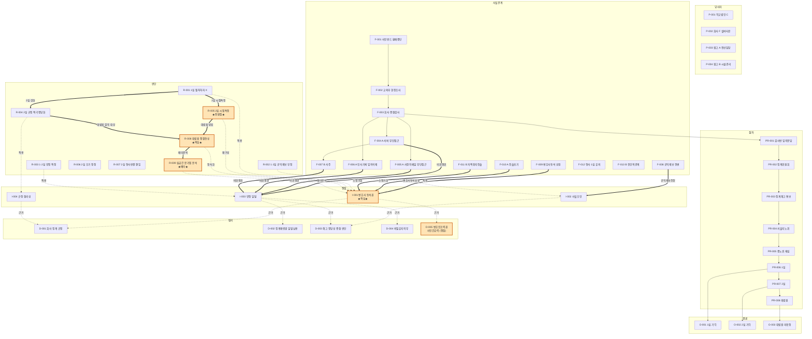

# Atom Graph (Mermaid)

> 이 그래프가 곧 "법률문서 파이프라인의 base graph". 노드는 atom, 엣지는 `related` 메타데이터.
> Obsidian에서 graph view로 보면 사실(F)·법리(D)·판단(R)·결론(O) 클러스터가 명확히 분리됨.

## 그래프 사용법

1. **시각 진입점**: 노란 박스(I-001, R-005, R-008, R-009, D-005)가 본 사건의 **법리적 전환점**.
2. **사실 → 쟁점 추적**: F-009(변호사동석 요청) → I-001(쟁점) → D-005(법리)가 가장 굵은 선.
3. **시간 흐름**: 좌측 PROC 칼럼이 시간축. PR-001 → PR-008.
4. **추상도 흐름**: 사실(F) → 절차(PR) → 쟁점(I) → 법리(D) → 판단(R) → 결론(O) 순으로 추상화.
